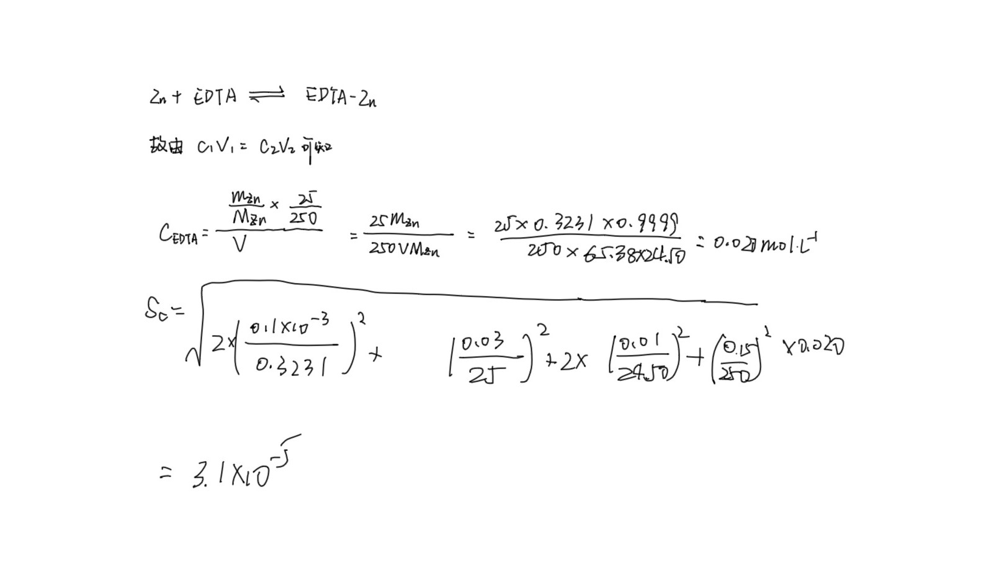
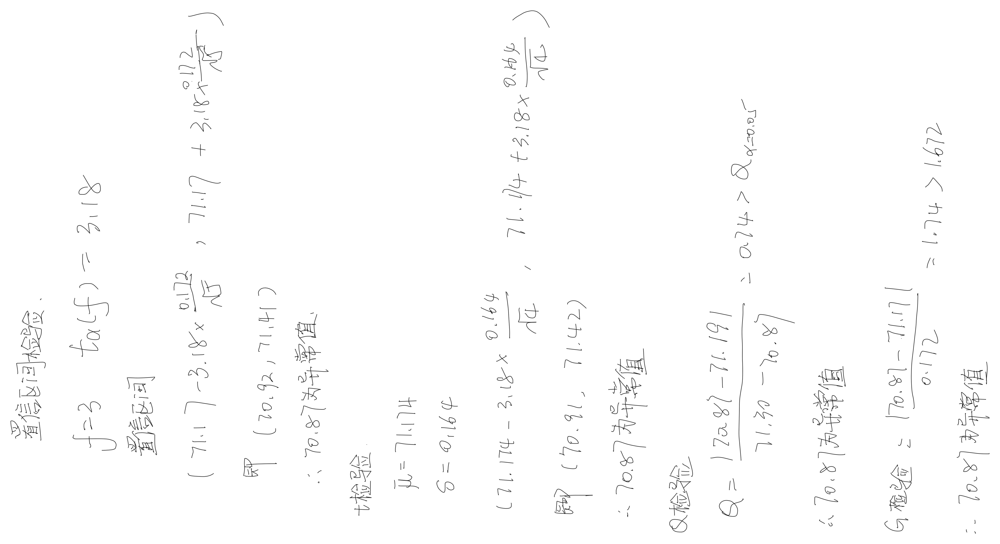

# Assignment 1

#### 第一题 

重量法、库仑法、凝固点下降法、称量滴定法和同位素稀释质谱法。

#### 第二题

正态分布是最一般的分布，u分布是正态分布的0,
1标准化形式，而t分布则用于较小样本的分布，当样本数n趋于无穷时，t分布则趋于正态分布。

#### 第三题 

39.0983\*2+51.9961\*2+15.9994\*7=242.1885

#### 第四题

#### 第五题

